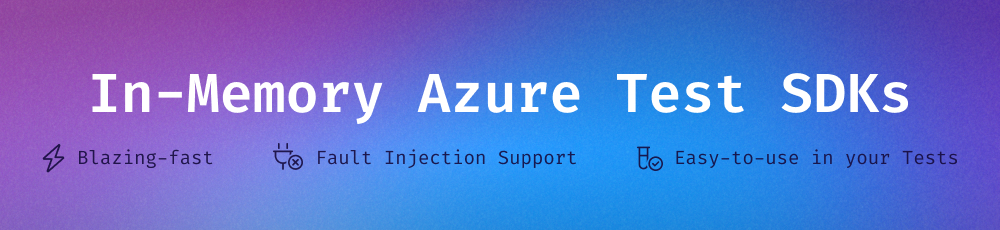

> [!NOTE]
> This repository has been discontinued. The Device SDK now being developed in the [spotflow-io/in-memory-azure-test-sdk](https://github.com/spotflow-io/in-memory-azure-test-sdk) repository.



<h1 align="center">Azure In-Memory SDKs for Testing</h1>
<p align="center">Drop-in fakes of Azure .NET SDKs to make your test blazing-fast and reliable.</p>

<p align="center">
    <a href="#supported-sdks">Supported SDKs</a> |
    <a href="#example">Example</a> |
    <a href="#key-features">Key features</a> |
    <a href="#why-should-i-use-it">Why Should I Use It?</a> |
    <a href="#how-it-works">How It Works</a> |
    <a href="#license">License</a>
</p>

## Supported SDKs

Visit the documentation for each SDK:
- [Datamole.InMemory.Azure.Storage](./docs/storage.md) for Azure Storage (`Azure.Storage.Blobs` and `Azure.Data.Tables`)
- [Datamole.InMemory.Azure.EventHubs](./docs/event-hubs.md) for Azure Event Hubs (`Azure.Messaging.EventHubs`)
- [Datamole.InMemory.Azure.ServiceBus](./docs/service-bus.md) for Azure Service Bus (`Azure.Messaging.ServiceBus`)

## Example

See how the in-memory Azure SDKs can be used in your code, for example with Azure Storage:

```csharp
var storageAccount = new InMemoryStorageProvider().AddAccount();

// The InMemoryBlobContainerClient inherits from BlobContainerClient (from the official SDK)
// So it can be used as a drop-in replacement for the real BlobContainerClient in your tests
BlobContainerClient containerClient = InMemoryBlobContainerClient.FromAccount(storageAccount, "test-container");

// From now on, you can use the BlobContainerClient methods as you're used to:
containerClient.Create();

await containerClient.UploadBlobAsync("my-blob", BinaryData.FromString("Hello World!"));

var blobClient = containerClient.GetBlobClient("my-blob");

var response = await blobClient.DownloadContentAsync();

Console.WriteLine(response.Value.Content.ToString());
// Output: Hello World!
```

This design allows you to create a factory for SDK clients with two implementations: one that provides the official Azure SDK clients and another that provides in-memory clients.
By selecting the appropriate factory, you can use the real implementation in your production code and the in-memory implementation in your tests.

You can learn how we recommend to use this library in [the documentations for each SDK](#supported-sdks).

## Key Features
- __Drop-in Replacement__ of the official Azure SDKs.
- __Blazing-fast__ thanks to the in-memory implementation.
- __Granular Fault Injection__: build resilient code thanks to simulated Azure outages in your tests.
- __`TimeProvider` Support__: avoid flaky tests thanks to the time abstraction.
- __Fluent Assertions__ to conveniently test common scenarios.

## Why Should I Use It?

There's been a lot written on why to prefer fakes over mocks in tests.
Mocks are test-doubles that return pre-programmed responses to method calls.
This can tightly couple your tests to implementation details, making them brittle and hard to maintain.
Fakes, on the other hand, are lightweight implementations of real services that can seamlessly integrate into your tests.
Using real services in tests is another approach, which is reasonable in many cases but can result in tests that are slow and harder to manage.

**One major drawback of fakes is the initial effort required to create them.
We have solved this problem by implementing them for you.**
This way, you can use the same interfaces and methods as in the real SDKs, but with the benefits of in-memory implementation.

## How It Works
The Azure SDKs are [designed](https://learn.microsoft.com/en-us/dotnet/azure/sdk/unit-testing-mocking?tabs=csharp) for inheritance-based testability:

* Important methods are `virtual`.
* There are parameterless protected constructor available for all clients.
* There are static factories for creating most models.

The in-memory clients (e.g. `InMemoryBlobContainerClient` or `InMemoryEventHubConsumerClient`) provided by this library are inheriting the Azure SDK clients so that they can be injected to any code that expected the actual Azure SDK clients (the `BlobContainerClient` or `EventHubConsumerClient` the previous example). The tested code can therefore depend directly on Azure SDK clients and only abstract away creation of these clients. This removes the need to design and implement custom client interfaces.

The in-memory clients have similar constructors as real clients but they all also require a so-called in-memory provider (e.g. `InMemoryStorageProvider` or `InMemoryEventHubProvider`). The in-memory providers emulate the functionality of the actual services for which the SDK clients are created for (e.g. Azure Storage or Azure Event Hubs). The providers allows to read, change and assert the internal state during testing. For most Azure SDK clients, the in-memory providers are exposing corresponding types representing actual state. For example for `InMemoryBlobContainerClient: BlobContainerClient`, there is `InMemoryBlobContainer` type exposed by the provider. The important difference is that the `InMemoryBlobContainer` is representing the actual state (in this case an existing Azure Storage Blob Container) while `InMemoryBlobContainerClient` might be representing container that does not yet exist.

## License
This project is licensed under the [MIT license](./LICENSE.md).
